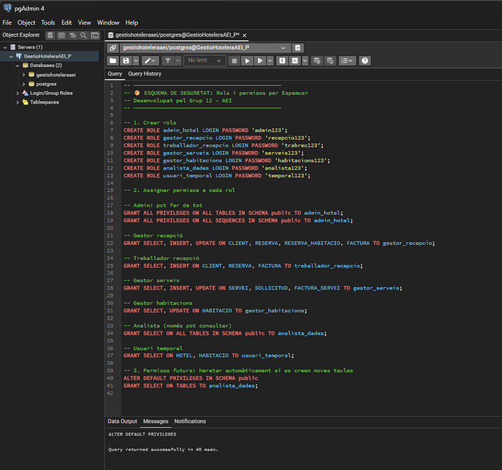
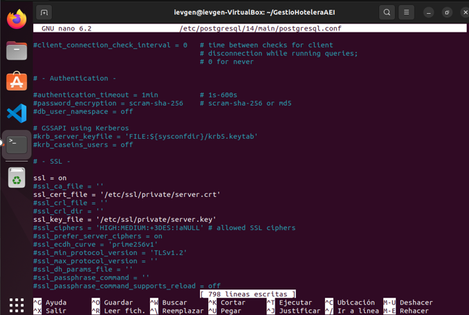
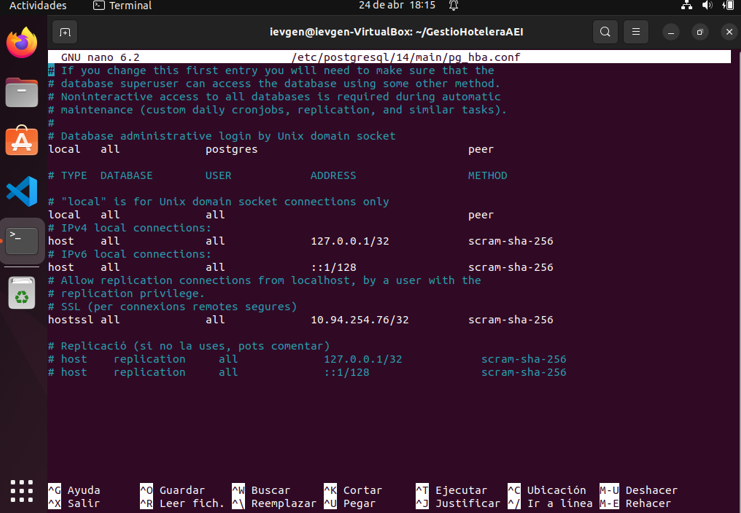
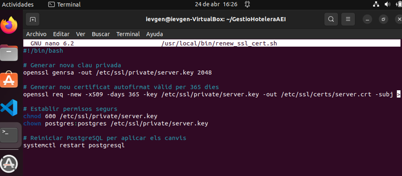
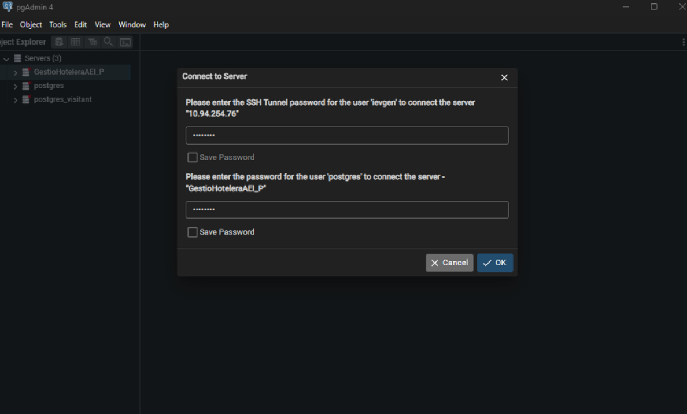

# Esquema de Seguretat – Gestió Hotelera Espamus+

Aquest document recull l’estructura de seguretat de la base de dades del projecte **Espamus+**, amb la definició de rols, permisos, accés segur (SSL), data masking i estratègies per protegir informació sensible.

---

## 1️⃣ Matriu de Seguretat

| **Rol**                 | **Descripció**                              | **Taules afectades**                               | **Permisos otorgats**             |
|-------------------------|---------------------------------------------|-----------------------------------------------------|------------------------------------|
| `admin_hotel`           | Administrador complet de la BD              | Totes (`*`)                                        | `ALL PRIVILEGES`                   |
| `gestor_recepcio`       | Gestor de reserves i clients                | `CLIENT`, `RESERVA`, `FACTURA`                     | `SELECT`, `INSERT`, `UPDATE`       |
| `treballador_recepcio`  | Recepcionista amb permisos limitats         | `RESERVA`, `CLIENT`, `FACTURA`                     | `SELECT`, `INSERT`                 |
| `gestor_serveis`        | Responsable de serveis                      | `SERVEI`, `SOLLICITUD`, `FACTURA_SERVEI`           | `SELECT`, `INSERT`, `UPDATE`       |
| `gestor_habitacions`    | Gestor d’estat d’habitacions                | `HABITACIO`                                        | `SELECT`, `UPDATE`                 |
| `analista_dades`        | Consultes i informes per a estadístiques    | `FACTURA`, `RESERVA`, etc.                         | `SELECT`                           |
| `usuari_temporal`       | Usuari extern amb accés temporal limitat    | `HOTEL`, `HABITACIO`                               | `SELECT`                           |

---

## 2️⃣ SQL per Creació de Rols i Permisos

```sql
-- ─────────────────────────────────────────────
-- ESQUEMA DE SEGURETAT: Rols i permisos per Espamus+
-- Desenvolupat pel Grup 12 – AEI
-- ─────────────────────────────────────────────

-- 1. Crear rols
CREATE ROLE admin_hotel LOGIN PASSWORD 'admin123';
CREATE ROLE gestor_recepcio LOGIN PASSWORD 'recepcio123';
CREATE ROLE treballador_recepcio LOGIN PASSWORD 'trabrec123';
CREATE ROLE gestor_serveis LOGIN PASSWORD 'serveis123';
CREATE ROLE gestor_habitacions LOGIN PASSWORD 'habitacions123';
CREATE ROLE analista_dades LOGIN PASSWORD 'analista123';
CREATE ROLE usuari_temporal LOGIN PASSWORD 'temporal123';

-- 2. Assignar permisos a cada rol

-- Admin: pot fer de tot
GRANT ALL PRIVILEGES ON ALL TABLES IN SCHEMA public TO admin_hotel;
GRANT ALL PRIVILEGES ON ALL SEQUENCES IN SCHEMA public TO admin_hotel;

-- Gestor recepció
GRANT SELECT, INSERT, UPDATE ON CLIENT, RESERVA, RESERVA_HABITACIO, FACTURA TO gestor_recepcio;

-- Treballador recepció
GRANT SELECT, INSERT ON CLIENT, RESERVA, FACTURA TO treballador_recepcio;

-- Gestor serveis
GRANT SELECT, INSERT, UPDATE ON SERVEI, SOLLICITUD, FACTURA_SERVEI TO gestor_serveis;

-- Gestor habitacions
GRANT SELECT, UPDATE ON HABITACIO TO gestor_habitacions;

-- Analista (només pot consultar)
GRANT SELECT ON ALL TABLES IN SCHEMA public TO analista_dades;

-- Usuari temporal
GRANT SELECT ON HOTEL, HABITACIO TO usuari_temporal;

-- 3. Permisos futurs: heretar automàticament si es creen noves taules
ALTER DEFAULT PRIVILEGES IN SCHEMA public
GRANT SELECT ON TABLES TO analista_dades;
```

--- 



---

## 3️⃣ Connexió SSL – Justificació i Configuració

Per tal de garantir la seguretat de les dades emmagatzemades a la base de dades del projecte **Gestió Hotelera Espamus+**, hem configurat l'accés a **PostgreSQL** mitjançant connexions segures amb **SSL** (Secure Sockets Layer). Aquesta mesura ajuda a evitar la intercepció de dades delicades durant la comunicació entre el client i el servidor, especialment quan es tracta d'informació personal o financera com les dades dels clients i les targetes de crèdit.

📚 [Documentació oficial de PostgreSQL - SSL](https://www.postgresql.org/docs/current/ssl-tcp.html)

---

### 1.1 Generació dels certificats

S’han generat un certificat i una clau privada autofirmats amb **OpenSSL**:

```bash
# Generar la clau privada
openssl genrsa -out server.key 2048

# Establir permisos segurs
chmod 600 server.key
chown postgres:postgres server.key

# Generar el certificat autofirmat
openssl req -new -x509 -days 365 -key server.key -out server.crt
````

A continuació, els fitxers server.key i server.crt s'han mogut a la carpeta:

```bash
/etc/ssl/private/
````

---

### 1.2 Configuració de PostgreSQL

Edició del fitxer postgresql.conf per activar SSL:

```bash
ssl = on
ssl_cert_file = '/etc/ssl/private/server.crt'
ssl_key_file = '/etc/ssl/private/server.key'
````
---

---

Edició del fitxer pg_hba.conf per obligar connexions segures:

```bash
hostssl all all 10.94.254.76 scram-sha-256
````
---

---
Un cop realitzada la configuració, s’ha reiniciat el servei:

```bash
sudo systemctl restart postgresql
````

---

### 2️⃣ Renovació Automàtica de Certificats

Per garantir la continuïtat del servei segur, hem creat un sistema de renovació periòdica dels certificats SSL.

#### Script `renew_ssl_cert.sh`

El següent script genera nous certificats, els reemplaça i reinicia PostgreSQL automàticament:

```bash
#!/bin/bash

# Generar nova clau privada
openssl genrsa -out /etc/ssl/private/server.key 2048

# Generar certificat autofirmat vàlid per 365 dies
openssl req -new -x509 -days 365 -key /etc/ssl/private/server.key -out /etc/ssl/certs/server.crt -subj "/CN=localhost"

# Establir permisos segurs
chmod 600 /etc/ssl/private/server.key
chown postgres:postgres /etc/ssl/private/server.key

# Reiniciar PostgreSQL per aplicar el nou certificat
systemctl restart postgresql
````

Aquest script es guarda a:

```bash
/usr/local/bin/renew_ssl_cert.sh
````
---

--- 

### Programació automàtica amb cron

Per executar automàticament la renovació cada 300 dies, afegim aquesta entrada al crontab:

```bash
0 3 */300 * * /usr/local/bin/renew_ssl_cert.sh
````

Aquesta acció:

 🔁 Es fa cada 300 dies  
  
 ⏰ A les 3:00h del matí  
  
 🔐 Es fa sense intervenció manual  
  
 🔄 Reinicia automàticament PostgreSQL amb els nous certificats  

---

---

## Aplicació de Data Masking (Enmascarament de dades)

Per protegir les dades personals i sensibles dels usuaris, s’han implementat tècniques de **Data Masking** mitjançant l’ús de vistes i restringint permisos. Aquesta pràctica permet que determinats rols accedeixin només a versions parcialment anonimitzades de la informació.

### 1️⃣ Exemple: Dades Personals

#### Taula real:

```sql
CREATE TABLE persona (
    dni VARCHAR(15) PRIMARY KEY,
    nom VARCHAR(50),
    cognoms VARCHAR(100),
    telefon VARCHAR(20)
);
````

#### Vista enmascarada (només per usuaris sense permisos especials):

```sql
CREATE VIEW persona_masked AS
SELECT 
    CONCAT('XXX-', RIGHT(dni, 4)) AS dni,
    nom,
    cognoms,
    telefon
FROM persona;
````

#### Permisos:

```sql
REVOKE ALL ON persona FROM public;
GRANT SELECT ON persona_masked TO analista_dades;
````

--- 

### 2️⃣ Exemple: Número de Targeta

#### Taula real:

```sql
CREATE TABLE pagament (
    id_pagament SERIAL PRIMARY KEY,
    dni_client VARCHAR(15),
    num_targeta VARCHAR(20),
    import NUMERIC
);
````

#### Vista enmascarada (només per usuaris sense permisos especials):

```sql
CREATE VIEW pagament_masked AS
SELECT 
    id_pagament,
    dni_client,
    CONCAT('**** **** **** ', RIGHT(num_targeta, 4)) AS num_targeta,
    import
FROM pagament;
````

#### Permisos:

```sql
REVOKE ALL ON pagament FROM public;
GRANT SELECT ON pagament_masked TO analista_dades;
````

---

### 🛠️ BONUS: Funció de masking personalitzat amb RLS

Aquesta funció pot ser útil en casos avançats amb seguretat a nivell de fila o control personalitzat per rol:

```sql
CREATE OR REPLACE FUNCTION mask_dni(dni TEXT, user_role TEXT)
RETURNS TEXT AS $$
BEGIN
    IF user_role = 'analista_dades' THEN
        RETURN CONCAT('XXX-', RIGHT(dni, 4));
    ELSE
        RETURN dni;
    END IF;
END;
$$ LANGUAGE plpgsql;
````

---

## Estratègia per a l’Eliminació Segura de Dades de Targetes

### Objectiu

Evitar que les dades de targetes de crèdit es mantinguin a la base de dades un cop ja no són necessàries, complint la normativa del RGPD i les bones pràctiques de seguretat en gestió d’informació sensible.

---

### 🗂️ Taula afectada (exemple)

```sql
CREATE TABLE pagament (
    id_pagament SERIAL PRIMARY KEY,
    dni_client VARCHAR(15),
    num_targeta VARCHAR(20),
    data_pagament DATE,
    import NUMERIC
);
````

---

### ⏳ Condició de retenció

Només es mantindran les dades de num_targeta mentre:

      - El client encara està allotjat
      
      - O fins a 7 dies després del check-out

Passat aquest període, les dades s’hauran d'anonimitzar o eliminar.

---

### ✅ Opció 1: Pseudonimització (Recomanada)

Les dades sensibles es poden pseudonimitzar per mantenir un control però protegir la informació:

```sql
UPDATE pagament
SET num_targeta = 'XXXX-XXXX-XXXX-0000'
WHERE dni_client IN (
    SELECT dni_client
    FROM reserva
    WHERE dataFinal < CURRENT_DATE - INTERVAL '7 days'
);
````

---

### Automatització recomanada

Es pot automatitzar aquest procés mitjançant una funció + trigger o una tasca programada (cron).

## ✅ Funció SQL:

```sql
CREATE OR REPLACE FUNCTION eliminar_targetes_antigues()
RETURNS void AS $$
BEGIN
    UPDATE pagament
    SET num_targeta = 'XXXX-XXXX-XXXX-0000'
    WHERE dni_client IN (
        SELECT dni_client
        FROM reserva
        WHERE dataFinal < CURRENT_DATE - INTERVAL '7 days'
    );
END;
$$ LANGUAGE plpgsql;
````

---

### 🛡️ Justificació de Seguretat i Legalitat


✅ Compliment del principi de minimització de dades (RGPD)  

✅ Protecció davant robatoris de base de dades o fuites d’informació  

✅ Reducció del risc d’accés indegut per part d’usuaris interns  

✅ Compliment de la legislació vigent i bones pràctiques del sector  

---

## Autors

**Grup 12 - AEI**  
Cicle Formatiu de Grau Superior d’**Administració de Sistemes Informàtics i Xarxes (ASIX)**  
**INS Sa Palomera – Curs 2024/2025**


---

## 🔗 Repositori principal del projecte
➡️ [Veure projecte principal a GitHub](../README.md)

---
