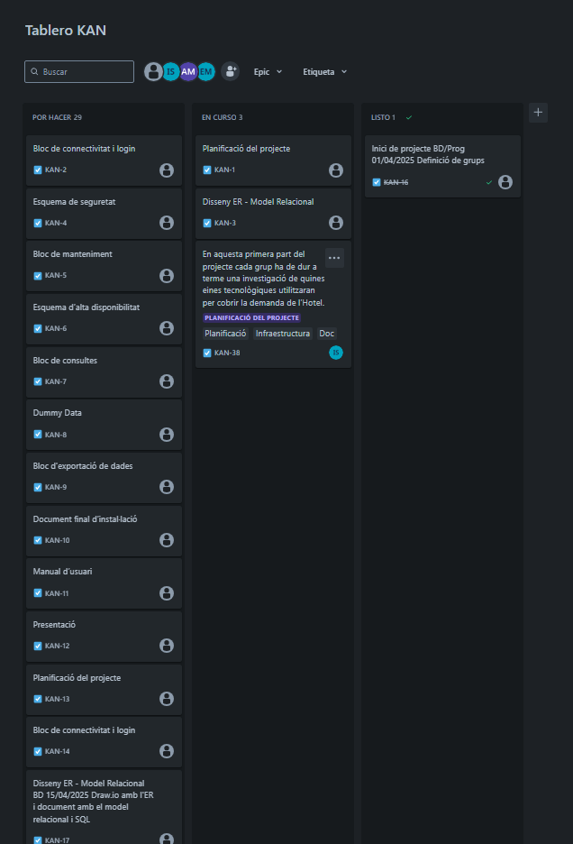
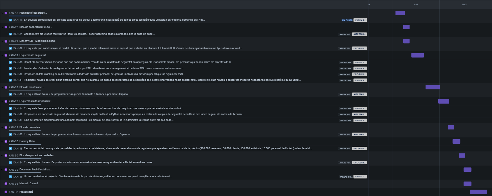

# Planificació del Projecte

Aquest document recull la planificació inicial del projecte **Gestió Hotelera Espamus+**, incloent:

- Tasques al Jira (cronograma, epics, descripcions)
- Assignació de rols
- Organització del codi i estructura de carpetes
- Enllaç al repositori principal

---

## Captures del Jira

### ✔️ Vista general del cronograma

### ✔️ Tasques detallades amb descripcions

---

## 🔗 Repositori principal del projecte
➡️ [Veure projecte principal a GitHub](../README.md)
